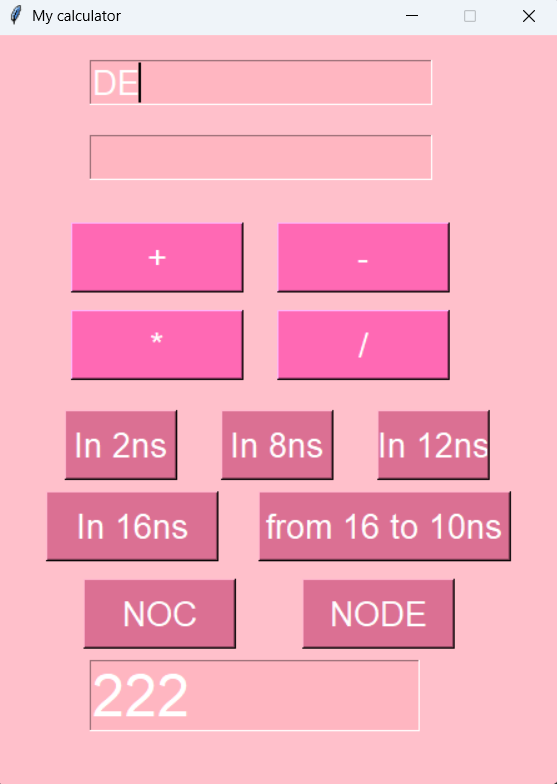

## Description
Hello! I want to introduce you to my first Python project! It is a calculator with many types of calculations. I didn't do it right away, I had to finish it gradually.
## Features
1. Performs important operations: addition, subtraction, multiplication, division. 
2. Calculates the number system: binary, octal, hexadecimal, hexadecimal, from hexadecimal to decimal. 
3. Calculates: NOC and NODE.  
4. It has an interesting graphical interface. 
5. Knows how to work with negative numbers.
## Screenshot

